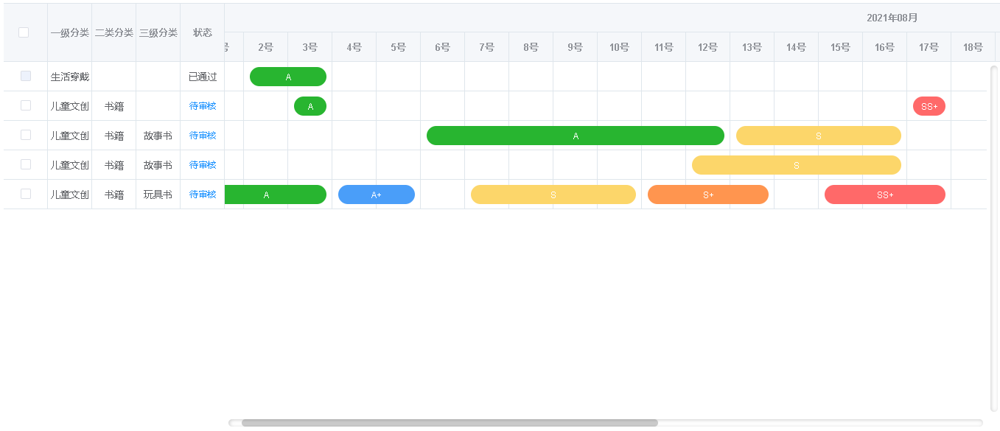

# qingha-gantt
简易的VUE甘特图UI组件

# 效果展示

# 配置说明

```
import QinghaGantt from "@/components/qingha-gantt";
<QinghaGantt
          :columns="gantt.columns"
          :title="gantt.title"
          :days="gantt.days"
          :table="gantt.table"
          :getColor="getColor"
          @tasksItemClick="tasksItemClick"
        />

```
```
gantt: {
        title: "",标题名称
        days: 0, //需要指定展示多少天,当月数据
        table: [ //此处展示具体数据
　　　　　　　[{
　　　　　　　　　
　　　　　　　　　　levelOne:"儿童文创",
　　　　　　　　　　tasks:[{
                         label: "A",
　　　　　　　　　　　　　　 start: 2, //开始
　　　　　　　　　　　　　　 end: 3,//结束
　　　　　　　　　　　　　　 progress:3//当前所在位置

　　　　　　　　　　}]

　　　　　　　}]
　　　　 ],
        columns: [
          {
            label: "", //声明表头名称,可以不指定,实现下方 labelrender 的h函数 渲染表头
            value: "id", //所取字段的key 帮助其从后台数据中取出值,也可以不指定 实现下方render 的h函数 可以渲染当前cell
            width: 10, //设定长度
            labelrender: (h) => {
              return h("el-checkbox", {
                props: {
                  type: "success",
                  size: "small",
                },
                style: {
                  marginRight: "5px",
                },
                on: {
                  change: (event) => {
　　　　　　　　　　　　　　this.checkValueAllChange(event);
                  },
                },
              });
            },
            render: (h, params) => {
              return h("el-checkbox", {
                props: {
                  value: params.row.checkValue,
                  
                },
                on: {
                  change: (event) => {
                    this.checkValuChange(event, params.row, params.index);
                  },
                },
              });
            },
          },
          {
            id: 2,
            label: "一级分类",
            value: "levelOne",
            // width: 50,
          },
 
        ],
      },

```

```
/** 方法说明 */
//:getColor="getColor"
//可用于控制task颜色
　　getColor(task) { 
      return "#4C4C4C";
    },

// @tasksItemClick="tasksItemClick"
//每个task点击会调用的方法
　　tasksItemClick(info, item, infoindex, index){
      console.log(info);
      console.log(item);
    },
```

# 使用方法
```
npm install --save qingha-gantt
```